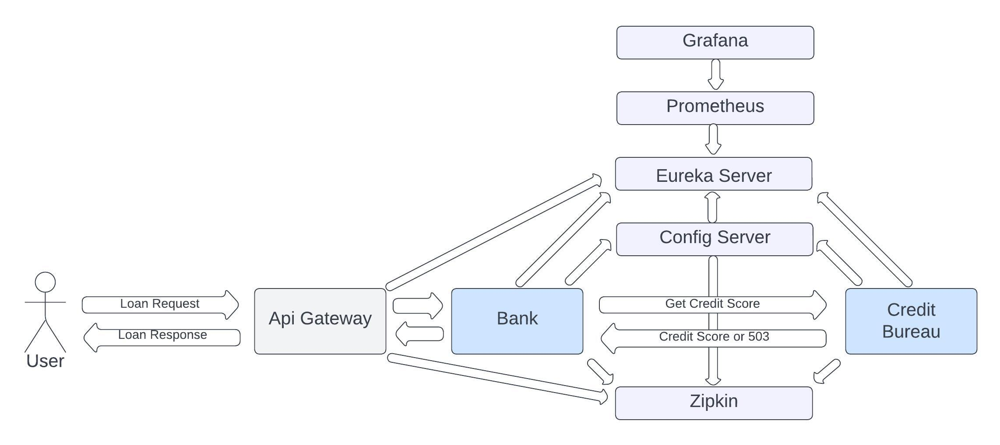

# Microservices 

Project consists of API Gateway, Bank microservice, Credit Bureau microservice, Zipkin,
Config Server, Eureka Server, Prometheus and Grafana:

## How to run
You can use Docker Compose to start all components. Steps:
1. Run `docker-compose up -d` in the project root.
2. Using Eureka UI check if all services are up: http://localhost:8761
3. Using Prometheus UI check if all services are scraped for metrics: http://localhost:9090/targets
4. Import `Microservices.postman_collection.json` in Postman. You can call Bank and Credit Bureau
endpoints directly or through API Gateway. Also, using Config Server `Upsert Properties` endpoint 
and `Refresh Context` endpoints of Bank and Credit Bureau, you can change properties, 
which will affect loan responses.
5. After sending requests fetch logs from Bank container or Credit Bureau container
(you can use Docker Desktop or `docker logs <container-name>` command) and copy some trace id 
(alphanumeric characters before first dash - for example, 
**657899e96c48438f9ef11e3cebffd8e9**-36af910e10411ec5). Open Zipkin UI and search trace by 
trace id: http://localhost:9411/zipkin/. Sometimes Zipkin shows 'No trace found' popup, but finds 
trace, so you can ignore popup in that case.
6. Use Grafana UI to check metrics: http://localhost:3000/. Username - `user`, 
password - `password`. There is a preconfigured dashboard: &#9776;&nbsp; -> 
Dashboards -> Request Rates.

Swagger:
- Bank - http://localhost:8080/swagger-ui/index.html
- Credit Bureau - http://localhost:8081/swagger-ui/index.html
- Config Server - http://localhost:8888/api/docs/swagger-ui/index.html

## Notes
- Spring Boot 3 and Java 17 are used.
- For each Spring Boot application a separate Maven module is created (`api-gateway`, `bank`, 
`credit-bureau`, `config-server`, `eureka`).
- There is also `common` module for common logic - all services except `eureka` depend on it.
- Config Server is integrated with MySQL DB. DB migration tool: Liquibase.
- Code coverage threshold: 85%.
- Tests: JUnit 5, Mockito, MockMvc.
- Checkstyle is configured.
